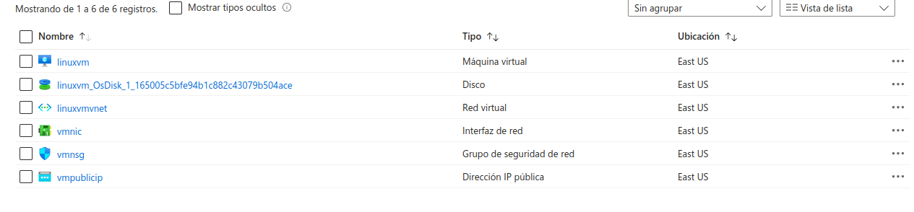
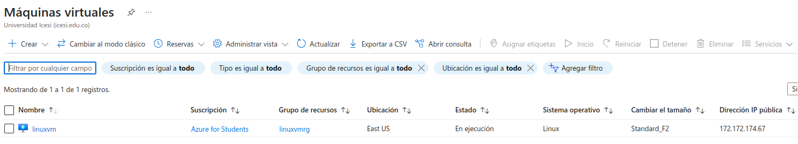
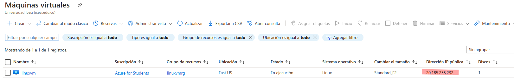
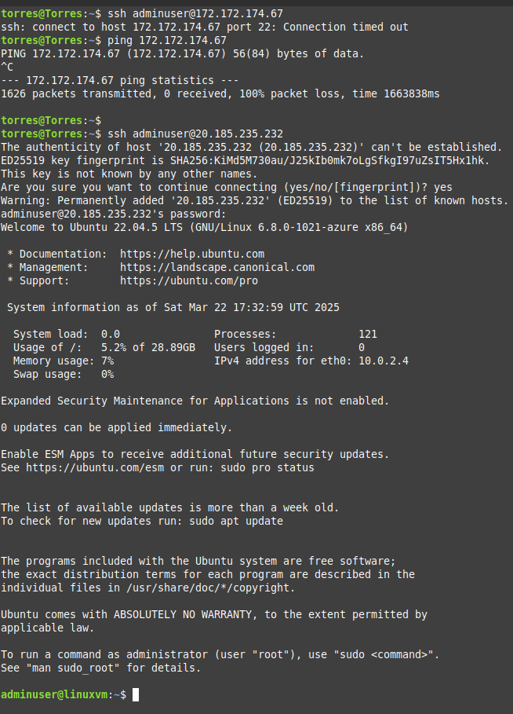

En este directorio esta el proceso de creación y despliegue de una maquina virtual de linux usando Terraform

Despues de seguir los pasos del codigo que hay en la pagina AzureRM documentation sobre [la máquina virtual de linux]("https://registry.terraform.io/providers/hashicorp/azurerm/latest/docs/resources/linux_virtual_machine"), llegamos a estos resultados:

La creación del grupo de recursos con sus recursos.

Luego la vista de la VM

Aqui se observa que la maquina inicialmente fue creada con una IP publica. Por lo tanto, no se puede acceder a ella mediante una conección SSH. Entonces, recurro a usar parte de codigo de la pagina de la documentación de Terraform para crear un [Network security group]("https://registry.terraform.io/providers/hashicorp/azurerm/latest/docs/resources/subnet_network_security_group_association") y asi poder saociar una IP publica la VM.

Finalmente, muestro la conexión SSH exitosa desde mi maquina.

